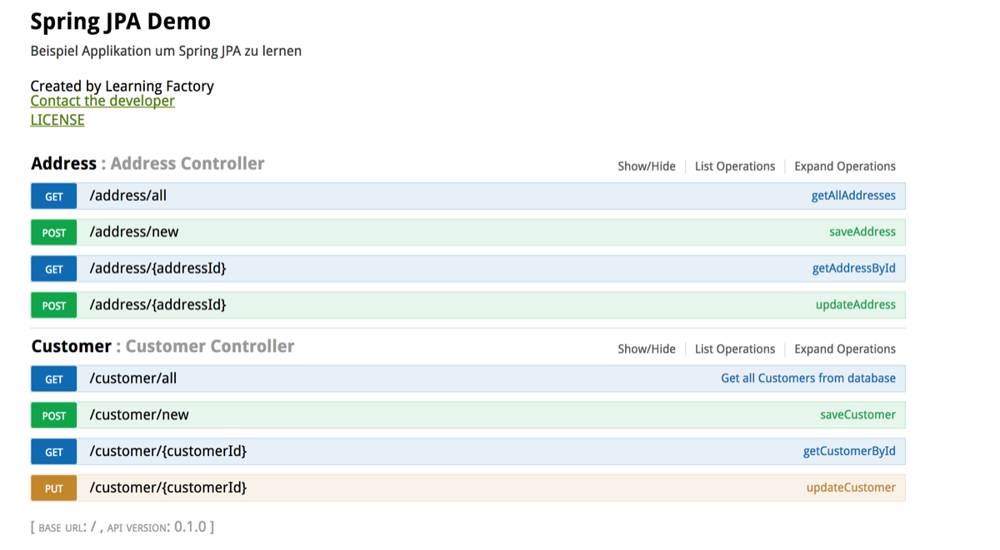

# Spring JPA Training

#### Inhalt

* [Voraussetzungen / Abhängigkeiten](#voraussetzungen)
* [Joining / Verknüpfungen](#joining)
  * [One To One](#onetoone)
  * [One To Many](#onetomany)
  * [Many To One](#manytoone)
  * [Many To Many](#manytomany)
* [API](#api)
* [Nützliche Links](#n%C3%BCtzliche-quellen)

### Voraussetzungen

* MySQL oder Maria Server installiert und gestartet
* MySQL User erstellt und die entsprechenden SQL Rechten vergeben

### Gradle Abhängigkeiten

```java
compile ("org.springframework.boot:spring-boot-starter-data-jpa")
compile("org.springframework.boot:spring-boot-starter-jdbc")
compile("mysql:mysql-connector-java:6.0.6")
```

### Spring Datenquelle konfigurieren

In der application-{evironment}.yml kann eine Datenquelle hinterlegt werden. 

```yaml
# Datasource - MySQL | MariaDB
spring.datasource.url=jdbc:mysql://localhost:3306/jpa_demo
spring.datasource.username=jpa
spring.datasource.password=jpa1234
```


## Joining


Some expect the JPA provider to have magic that automatically maintains relationships. This was actually part of the EJB CMP 2 specification. However the issue is if the objects are detached or serialized to another VM, or new objects are related before being managed, or the object model is used outside the scope of JPA, then the magic is gone, and the application is left figuring things out, so in general it may be better to add the code to the object model. However some JPA providers do have support for automatically maintaining relationships.
In some cases it is undesirable to instantiate a large collection when adding a child object. One solution is to not map the bi-directional relationship, and instead query for it as required. Also some JPA providers optimize their lazy collection objects to handle this case, so you can still add to the collection without instantiating it.

### OneToOne

In One-To-One relationship, one item can belong to only one other item. It means each row of one entity is referred to one and only one row of another entity.


```java
@Entity
public class Employee {
  @Id
  @Column(name="EMP_ID")
  private long id;
  ...
  @OneToOne(fetch=FetchType.LAZY)
  @JoinColumn(name="ADDRESS_ID")
  private Address address;
  
}
```
### ManyToOne


Many-To-One relation between entities: Where one entity (column or set of columns) is/are referenced with another entity (column or set of columns) which contain unique values. In relational databases these relations are applicable by using foreign key/primary key between tables.

```java
@Entity
public class Phone {
  @Id
  private long id;
  ...
  @ManyToOne(fetch=FetchType.LAZY)
  @JoinColumn(name="OWNER_ID")
  private Employee owner;
  ...
}
```

### OneToMany


In this relationship each row of one entity is referenced to many child records in other entity. The important thing is that child records cannot have multiple parents. In a one-to-many relationship between Table A and Table B, each row in Table A is linked to 0, 1 or many rows in Table B.

```java
@Entity
public class Employee {
  @Id
  @Column(name="EMP_ID")
  private long id;
  ...
  @OneToMany(mappedBy="owner")
  private List<Phone> phones;
  ...
}
```

### ManyToMany

A ManyToMany relationship in Java is where the source object has an attribute that stores a collection of target objects and (if) those target objects had the inverse relationship back to the source object it would also be a ManyToMany relationship. All relationships in Java and JPA are unidirectional, in that if a source object references a target object there is no guarantee that the target object also has a relationship to the source object. This is different than a relational database, in which relationships are defined through foreign keys and querying such that the inverse query always exists.


JPA also defines a OneToMany relationship, which is similar to a ManyToMany relationship except that the inverse relationship (if it were defined) is a ManyToOne relationship. The main difference between a OneToMany and a ManyToMany relationship in JPA is that a ManyToMany always makes use of a intermediate relational join table to store the relationship, where as a OneToMany can either use a join table, or a foreign key in target object's table referencing the source object table's primary key.

In JPA a ManyToMany relationship is defined through the @ManyToMany annotation or the <many-to-many> element.

All ManyToMany relationships require a JoinTable. The JoinTable is defined using the @JoinTable annotation and <join-table> XML element. The JoinTable defines a foreign key to the source object's primary key (joinColumns), and a foreign key to the target object's primary key (inverseJoinColumns). Normally the primary key of the JoinTable is the combination of both foreign keys.

```java
@Entity
public class Employee {
  @Id
  @Column(name="ID")
  private long id;
  ...
  @ManyToMany
  @JoinTable(
      name="EMP_PROJ",
      joinColumns=@JoinColumn(name="EMP_ID", referencedColumnName="ID"),
      inverseJoinColumns=@JoinColumn(name="PROJ_ID", referencedColumnName="ID"))
  private List<Project> projects;
  .....
}
```

### API

```
Base: http://localhost:8080
Swagger: http://localhost:8080/swagger-ui.html
```




### Nützliche Quellen

[Spring JPA Tutorial](https://spring.io/guides/gs/accessing-data-jpa/)


### Object/Relational Mapping (ORM)
[Was ist ein ORM ?](http://hibernate.org/orm/what-is-an-orm/)


#### Java Presitence (JPA)

[Was ist JPA ?](https://en.wikibooks.org/wiki/Java_Persistence/What_is_JPA%3F)

[Java Presitence Wiki](https://en.wikibooks.org/wiki/Java_Persistence) 

[Java Presitence Video](https://www.youtube.com/watch?v=gFhvihX0Pis)

#### Hibernate

[Hibernate with Spring](https://www.youtube.com/watch?v=0lqlg5tnDag)
